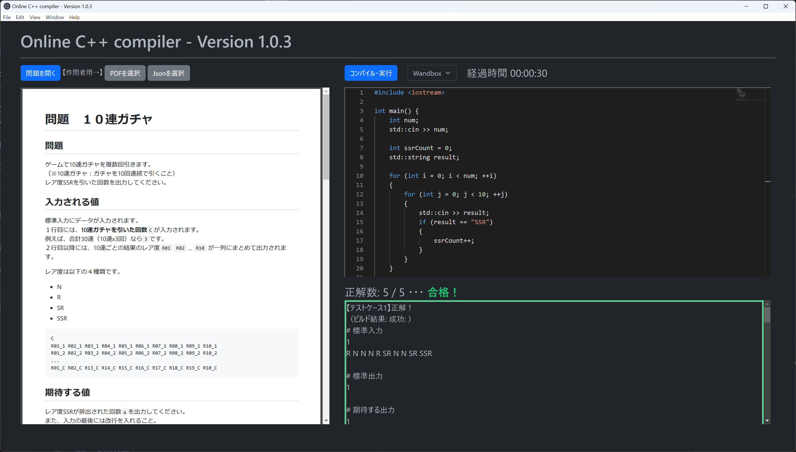

# Online C++ Compiler(Powered by Wandbox and Paiza.IO)

ElectronとHTML/JSの習作として開発した、オンラインC++コンパイラソフト。  
コンパイラ・実行部分は、Wandbox または Paiza.IOに依存しています。  

競技プログラミングのような問題を作問することもできます。  



## 作問方法

問題の例は、[./example_problems/](https://github.com/mewmew-tea/WebCompiler/tree/master/example_problems)にあります。  

### 作成するファイル

１問ごとに、以下の２つのファイルを作成します。  

**ファイル名は、必ず以下のとおりである必要があります。**  

- problem.pdf
- problemInfo.json

#### problem.pdf

問題のpdfファイル。作成方法は問いません。フォントサイズはやや大きめ推奨です。

#### problemInfo.json

問題についての情報を記したjsonファイルです。  

テストケースについて、標準入力に与える文字列`input`と、それに対応する、期待する出力`expect`を設定します。  
テストケースは、任意の件数設定することができます。  

```json
{
    "testCases": [
        {
            "input" : "100 200 300",
            "except" : "600\n"
        },
        {
            "input" : "1 2 3",
            "except" : "6\n"
        },
        {
            "input" : "10 20 30",
            "except" : "60\n"
        },
        {
            "input" : "1000 2000 3000",
            "except" : "6000\n"
        }
    ]
}
```


また、期待する出力と実際の出力について、許容する誤差を設定することもできます。  

許容する誤差を設定すると、期待する出力に以下の制限が発生します。  
- スペース区切りのみ対応
- すべての出力が１行目にある必要がある
- すべての出力が数値である必要がある（`ABC`のような文字列を含むことができない）

```json
{
  "errorMargin": 0.01,
  "testCases": [
    {
        ...
    }
}
```

### 問題をパッケージングする（配布形式にする）

パッケージ化された問題のファイル拡張子は、**.prob**です。  
.prob形式にパッケージングされた問題を、解答者へ配布することができます。  

なお、実際のファイル形式はzipファイルです。（拡張子を変更するだけ）  
すなわち、以下の手順でパッケージすることができます。  

1. ２つのファイルを、zip圧縮する。  
> **Warning**  
> **展開時、直下に２つのファイル（`problem.pdf`、`problemInfo.json`）があるようにしてください。  
> Windowsなら、２つのファイルを複数選択した状態で右クリック、[送る]、[ZIP（圧縮）形式フォルダ]**
2. ファイルの拡張子を`.prob` にリネームする。ファイル名は任意の名前でOKです。  


## 今後このソースを触りたい人へ

Electronなどについてのメモを残しておきました。  
参考程度にどうぞ。  
[./memo_about_electron.md](https://github.com/mewmew-tea/WebCompiler/tree/master/memo_about_electron.md)

## How to Build

### Requirements

- git
- Node.js v18.13.0

### Clone and setup

```
git clone https://github.com/mewmew-tea/WebCompiler.git
cd WebCompiler
npm install
```

### Run the application

```
npm run start
```

### Build executable

Windows(x64)

```
npx electron-builder --win --x64 --dir
```
